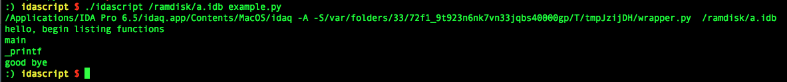

# idascript

Console mode IDA script launcher with stdin/stdout handled. A pty is used to pass stdin/stdout, so you can directly view your stdout/stderr at the same terminal. There is no need to write to file and cat it later.

# Example

    $ idascript your.idb example.py 

The result is like this.

# Configuration

Just change the `IDA_PATH` variable to your installation path.

# Dependency

- python2
- termcolor(optional)

if you need colored output, install `termcolor` beforehand

    $ sudo pip install termcolor
